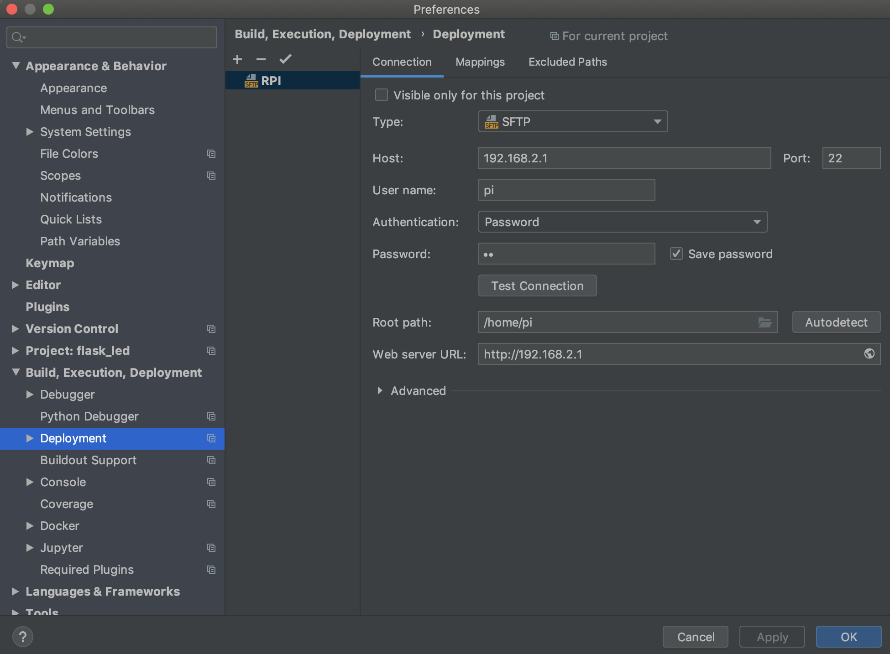
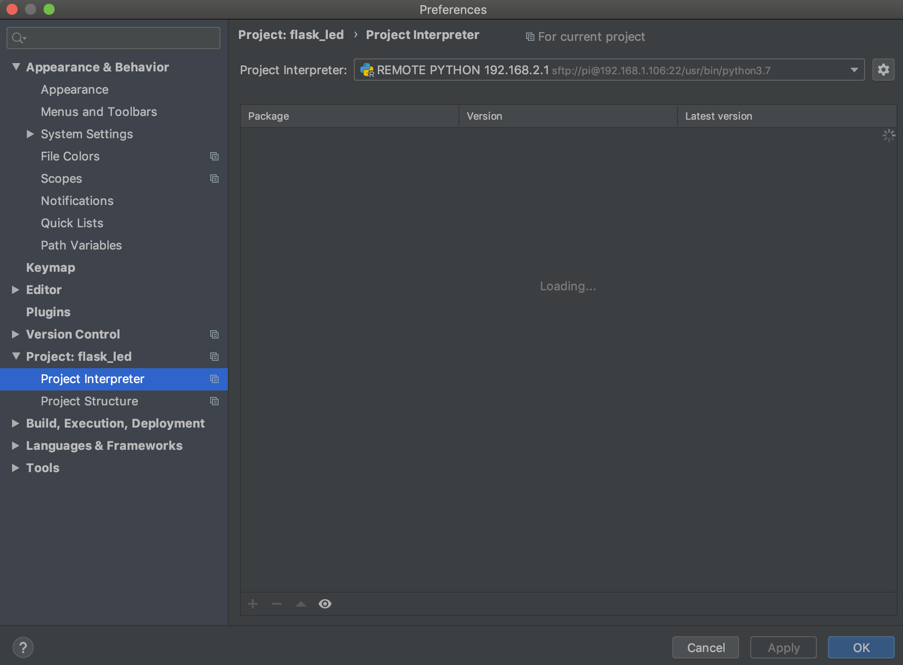

A short demo for IT2 Lesson; How to use Flask to light up LEDs on a PI


## -1 - PYCHARM REMOTE DEBUGGIN





## 0 -FIRST
* SHOW FOLDER STRUCTURE
* SHOW HOW TO CONNECT TO THE PI OVER A TERMINAL
* SHOW PYCHARM SETTINGS
* SHOW STARTED SERVER WHERE GOT A 404
* EXPLAIN BASIC FILES STRUCTURE WHAT IS THERE


```python
LED_PIN_1 = 7
LED_PIN_2 = 0
BUTTON_YELLOW_PIN = 9
BUTTON_BLUE_PIN = 8
```

```python
app = Flask(__name__, static_url_path='/static')
```

## 1 - FLASK - REDIRECT TO INDEX.html
```python
@app.route('/')
def index_redirect():
    return redirect("/static/index.html", code=302)
```
* explain a redirect


## 2 - FLASK - API - ButtonStatus

```python
@app.route('/api/status', methods=['get'])
def api_status():
    global wiringpi
    status = {}
    status['button_yellow'] = True
    status['button_blue'] = False
    return jsonify(status)
```
* explain @app route

## 3 - HTML - IMAGES FOR BUTTON
```html
<table>
  <tr>
    <td></td><!-- 4 -->
    <td></td><!-- 4 -->
  </tr>
</table>
```
* explain basic images WITH ID --- !!


## 4 - JS- GET BUTTON STATE FROM API
```js
 $.get( "/api/status", function( data ) {
      console.log(data);
      
      //----6 ----/*
      if(data.button_yellow){
        $("#btn_yellow_img").attr("src","img/btn_yellow_pressed.png");
      }else{
        $("#btn_yellow_img").attr("src","img/btn_yellow_released.png");
      }

      //----7 ----/*
      if(data.button_blue){
        $("#btn_blue_img").attr("src","img/btn_blue_pressed.png");
      }else{
        $("#btn_blue_img").attr("src","img/btn_blue_released.png");
      }

    });
```
* EXPLAIN `$()` to acces ement
* EXPLAIN GET REQUEST VS the normal /api/status request


## 5 - JS - DO IN INTERVAL
```js
setInterval(function(){
// DO STH EVERY 100 MS
},100);
```
* EXPLAIN SET INTERVAL

## 6 - FLASK - INIT GPIO
```python
wiringpi.wiringPiSetup()
# SETUP PINS
LED_PIN_1 = 7
LED_PIN_2 = 0
BUTTON_YELLOW_PIN = 9
BUTTON_BLUE_PIN = 8
# SET TO OUTPUT
wiringpi.pinMode(LED_PIN_1, 1)
wiringpi.pinMode(LED_PIN_2, 1)
wiringpi.digitalWrite(LED_PIN_1, 0)
wiringpi.digitalWrite(LED_PIN_2, 0)

# 12
# SET INPUT
wiringpi.pinMode(BUTTON_YELLOW_PIN, 0)
wiringpi.pinMode(BUTTON_BLUE_PIN, 0)
# ENABLE PULLUP
wiringpi.pullUpDnControl(BUTTON_YELLOW_PIN, 2)
wiringpi.pullUpDnControl(BUTTON_BLUE_PIN, 2)
```
* EXPLAIN PINMODE
* SHOW pinout xyz
* EXPLAIN PULLUP


## 7 - FLASK - READ BUTTON INPUTS
```python
    status['button_yellow'] = not bool(wiringpi.digitalRead(BUTTON_YELLOW_PIN))
    status['button_blue'] = not bool(wiringpi.digitalRead(BUTTON_BLUE_PIN))
```
* TEST THIS
* the `not` is because we used PULLUP setup in wiring pi; so the normal state (not pressed) is HIGH/True


## 8 - JS - WRITE LED SET_FUNCTION
```js
 function set_led(_led_index,_status){
      console.log(_led_index + " " +_status);

      $.post( "/api/set_led", { led_index: _led_index, status: _status },function (data) {
          console.log(data);
      } );
    }
```
* EXPLAIN THE CALL
* SHOW DEBUG LOG KLICKING BUTTON
* EXPLAIN POST REQUEST WITH DATA


## 9 - HTML - ADD LED SWITCH BUTTONS
```html

 <button type="button" class="btn btn-success" onclick="set_led(1,1)">SET LED 1 ON</button><!-- 9 -->
 <button type="button" class="btn btn-danger" onclick="set_led(1,0)">SET LED 1 OFF</button><!-- 9 -->
  

   <button type="button" class="btn btn-success" onclick="set_led(2,1)">SET LED 2 ON</button><!-- 9 -->
   <button type="button" class="btn btn-danger" onclick="set_led(2,0)">SET LED 2 OFF</button><!-- 9 -->
 
```
* EXPLAIN onclick event


## 10 - FLASK - SET LEDs API
```python
@app.route('/api/set_led', methods=['post'])
def set_led():
    global wiringpi
    # 9
    content = request.form
    print(content['led_index'])

    return jsonify({'status': 'ok'})
```
* DEBUG! request ->what we get from browser; and explain that our data are in form
*


## 11 - FLASK - ADD LED OUTPUT (`def set_led():`)
```python
if int(content['led_index']) == 1:
        wiringpi.digitalWrite(LED_PIN_1, int(content['status']))  # 12
    elif int(content['led_index']) == 2:
        wiringpi.digitalWrite(LED_PIN_2, int(content['status']))  # 12
```


## 12 - FLASK - ADD DB LOG ROUTE
```python
@app.route('/api/get_log', methods=['get'])
def get_log():
    global DB_IP
    logs = [];
    couch_client = CouchDB('admin', 'admin', url='http://' + DB_IP + ':5984', connect=True)
    log_db = couch_client['logs']
    for document in log_db:
        logs.append(document)
    couch_client.disconnect();
    return jsonify(logs)
```

## 13 - HTML - ADD DIV AS LOG PLACEHOLDER
```html
<br>
<br>
<div id="log">
```

## 14 - JS - ADD DB CALL READ

```js
   $.get( "/api/get_log", function( data ) {
      console.log(data);
      var tmp_html = "--- LOGS ---<br>";

      for(var i = 0; i < data.length; i++){
        tmp_html +=  data[i].action + "<br>";
         }

      $("#log").html(tmp_html);
      });
```

## 15 - FLASK - ADD DB INSERT
```python
 # 13 -- DATABSE WRITE DOCUEMTENT --
    couch_client = CouchDB('admin', 'admin', url='http://' + DB_IP + ':5984', connect=True)
    log_db = couch_client['logs']
    doc = log_db.create_document(
        {'action': "SET LED " + str(content['led_index']) + " BY USER TO " + str(content['status'])})
    couch_client.disconnect();

```
